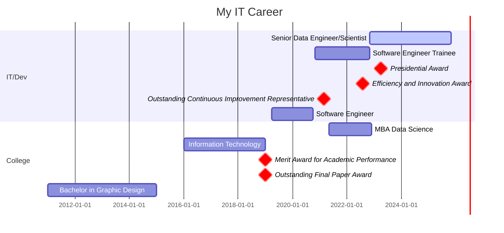

<div>
 
</div>
<hr>

<div align='left'>
<h4>Connect with me:</h4>
</div>
<div align='left'>
<a href="https://linkedin.com/in/jhroveda" target="blank"></a>
</div>
<br>
<div align='left'>
 
</div>
<br>


``` http
Software Engineer | Fullstack | Frontend | React | Next.js | Javascript | Python | SQL
```
#### 📌 [Check out my Portfolio page here!](https://jhroveda-portfolio.vercel.app/)

As a Full Stack Software Engineer with a strong foundation in data-driven development, I bring a unique blend of UI/UX insight and technical skills to my work. My experience spans frontend technologies like React, JavaScript, HTML, and CSS, as well as backend frameworks (FastAPI, Next.js) and a background in data analysis and engineering. With over five years of experience in the tech industry, I am dedicated to creating intuitive, user-centered digital experiences and am constantly evolving my knowledge in frontend development. My goal is to contribute to innovative, impactful projects, focusing on building responsive, engaging interfaces that enhance user experience and bridge the gap between design and functionality.

Fast learner, good in troubleshooting and eager to collaborate on impactful projects.

<h3>Knowledge and experiences:</h3>

- Javascript, HTML, CSS;
- React, Next.js;
- Data engineering and data science;
- Python, FastAPI;
- Test-Driven Development (TDD);
- PostgreSQL and SQLite databases;
- Knowledge in Azure Cloud;
- Fluent Portuguese, advanced English and basic Spanish;

<h4>Open source contribuitions</h4>

- I developed a python library to store logs in MongoDB and send notifications of errors to MS Teams - <a href="https://pypi.org/project/logze/">logze</a>
- I developed a python library that provides functionality to read data from Excel and CSV files and insert it into a Microsoft SQL Server database. - <a href="https://pypi.org/project/excel2mssql/">excel2mssql</a>
- I developed a julia package for encoding cyclical values using sine and cosine - <a href="https://github.com/josehenriqueroveda/CyclicalEncoding.jl">CyclicalEncoding.jl</a>

<br>
<hr>

<h2>IT Career</h2>



---
<h2>🛠️ Technologies:</h2>


 
 


 
 

[](https://github.com/josehenriqueroveda/github-readme-stats)

<h3>Coding Stats:</h3> 

<a href="https://wakatime.com/@5737d08e-0c08-459f-9ef9-19fc41ca4423&style=plastic"></a>


<!--START_SECTION:waka-->

```txt
From: 05 February 2025 - To: 12 February 2025

JavaScript   10 hrs 42 mins  ⣿⣿⣿⣿⣿⣿⣿⣿⣿⣿⣿⣿⣿⣿⣿⣿⣿⣿⣿⣿⣿⣿⣿⣿⣷   99.09 %
Other        3 mins          ⣄⣀⣀⣀⣀⣀⣀⣀⣀⣀⣀⣀⣀⣀⣀⣀⣀⣀⣀⣀⣀⣀⣀⣀⣀   00.55 %
JSON         2 mins          ⣄⣀⣀⣀⣀⣀⣀⣀⣀⣀⣀⣀⣀⣀⣀⣀⣀⣀⣀⣀⣀⣀⣀⣀⣀   00.35 %
```

<!--END_SECTION:waka-->


<h3>GitHub Stats</h3>

<p>&nbsp;</p>

<h3>GitHub Trophies</h3>
 
 [](https://github.com/josehenriqueroveda/github-profile-trophy)


---
