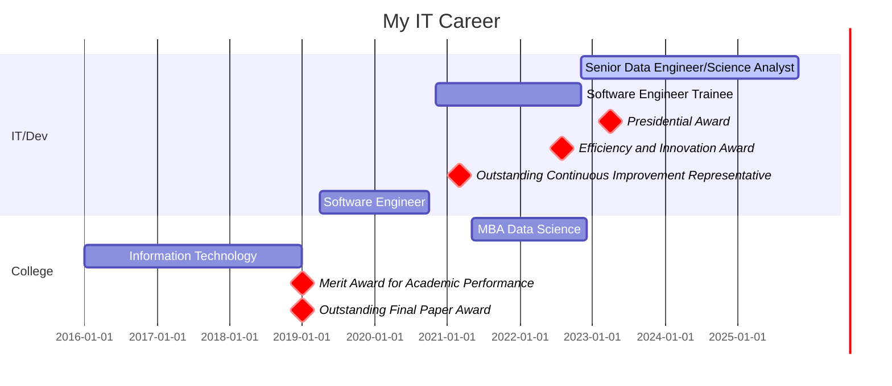

<code align="left">Welcome to my <b>github</b>!</code>
<br>
<div align='left'>
<b>Connect with me:</b>
</div>
<div align='left'>
<a href="https://linkedin.com/in/jhroveda" target="blank"></a>
</div>
<br>
<div align='left'>
 
</div>
<br>


``` http
Backend Engineer | Ruby on Rails | Python | Data Engineer
```
#### 📌 [Check out my CV here!](https://josehenriqueroveda.github.io/)

<h3>Knowledge and experiences:</h3>

- Solid experience in programming with Ruby on Rails and Python;
- Frontend knowledge (Vue.js, Hotwire);
- Data engineering and data science;
- Knowledge in Azure Cloud;
- SQL;
- Git;
- Github;
- Rspec (tests)
- RSwag (documentation)
- Fluent Portuguese, advanced English and basic Spanish.

<h4>Open source contribuitions</h4>

- I developed a python library to store logs in MongoDB and send notifications of errors to MS Teams - <a href="https://pypi.org/project/logze/">logze</a>
- I developed a python library that provides functionality to read data from Excel and CSV files and insert it into a Microsoft SQL Server database. - <a href="https://pypi.org/project/excel2mssql/">excel2mssql</a>
- I developed a julia package for encoding cyclical values using sine and cosine - <a href="https://github.com/josehenriqueroveda/CyclicalEncoding.jl">CyclicalEncoding.jl</a>

<br>
<hr>

<h2>IT Career</h2>



---
<h2>🛠️ Technologies:</h2>

 
 

[](https://github.com/josehenriqueroveda/github-readme-stats)

<h3>Coding Stats:</h3> 

<a href="https://wakatime.com/@5737d08e-0c08-459f-9ef9-19fc41ca4423&style=plastic"></a>


<!--START_SECTION:waka-->

```txt
From: 08 October 2024 - To: 15 October 2024

Ruby       12 hrs 24 mins  ⣿⣿⣿⣿⣿⣿⣿⣿⣿⣿⣿⣿⣿⣿⣿⣿⣿⣿⣿⣿⣿⣿⣷⣀⣀   91.32 %
Python     45 mins         ⣿⣤⣀⣀⣀⣀⣀⣀⣀⣀⣀⣀⣀⣀⣀⣀⣀⣀⣀⣀⣀⣀⣀⣀⣀   05.56 %
Markdown   19 mins         ⣶⣀⣀⣀⣀⣀⣀⣀⣀⣀⣀⣀⣀⣀⣀⣀⣀⣀⣀⣀⣀⣀⣀⣀⣀   02.34 %
YAML       3 mins          ⣄⣀⣀⣀⣀⣀⣀⣀⣀⣀⣀⣀⣀⣀⣀⣀⣀⣀⣀⣀⣀⣀⣀⣀⣀   00.40 %
Other      1 min           ⣀⣀⣀⣀⣀⣀⣀⣀⣀⣀⣀⣀⣀⣀⣀⣀⣀⣀⣀⣀⣀⣀⣀⣀⣀   00.24 %
```

<!--END_SECTION:waka-->


<h3>GitHub Stats</h3>

<p>&nbsp;</p>

<h3>GitHub Trophies</h3>
 
 [](https://github.com/josehenriqueroveda/github-profile-trophy)


---
