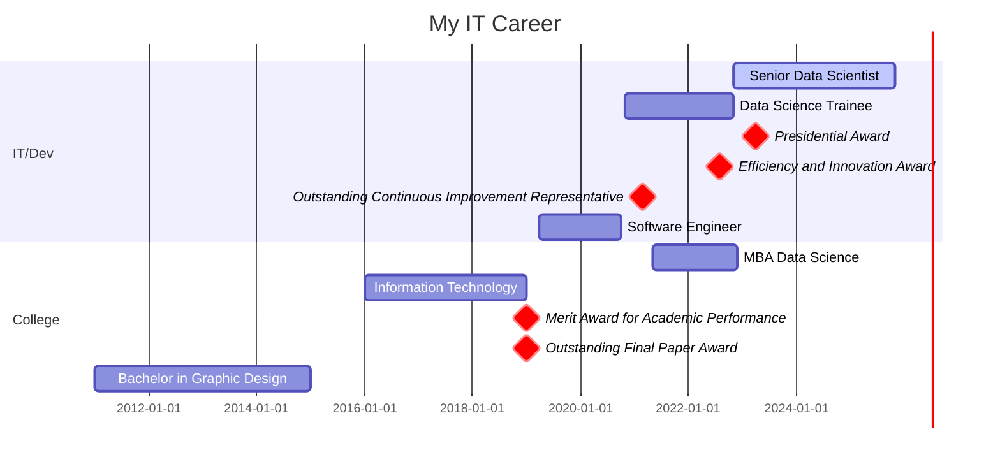

<div>
 
</div>
<hr>

<div align='left'>
<h4>Connect with me:</h4>
</div>
<div align='left'>
<a href="https://linkedin.com/in/jhroveda" target="blank"></a>
</div>
<br>
<div align='left'>
 
</div>
<br>


``` http
Senior Data Scientist | Data Engineer | AI | Machine Learning | Python | SQL
```
#### 📌 [Check out my Portfolio page here!](https://josehenriqueroveda.github.io/)

I am an analytical Data Scientist and Data Engineer with over five years of experience in designing and implementing data pipelines, machine learning models, and AI solutions. My expertise includes Python, SQL, and FastAPI, focusing on efficient data processing and automation. My goal is to create intelligent, scalable, and impactful data solutions that drive business value.

💡 What I Bring to the Table:<br>
✔️ Data Science & AI– Passionate about integrating AI, LLMs (Large Language Models), and machine learning models as problem solvers.<br>
✔️ Backend Development – Experience in FastAPI, and PostgreSQL, building RESTful APIs and microservices for backends.<br>
✔️ Data-Driven Insights – Strong foundation in data engineering, ETL pipelines, and AI-powered analytics, ensuring applications leverage data effectively.<br>
✔️ Languages – Competent in Python and SQL. Willing to learn new languages and technologies.<br>
<br>
🌍 Open to remote or hybrid opportunities abroad (US, Canada, Europe) and interested in collaborating on cutting-edge AI-powered applications. Let's connect and build something innovative! 🚀

<h4>Open source contribuitions</h4>

- I developed a python library to store logs in MongoDB and send notifications of errors to MS Teams - <a href="https://pypi.org/project/logze/">logze</a>
- I developed a python library that provides functionality to read data from Excel and CSV files and insert it into a Microsoft SQL Server database. - <a href="https://pypi.org/project/excel2mssql/">excel2mssql</a>
- I developed a julia package for encoding cyclical values using sine and cosine - <a href="https://github.com/josehenriqueroveda/CyclicalEncoding.jl">CyclicalEncoding.jl</a>

<br>
<hr>

<h2>IT Career</h2>



---
<h2>🛠️ Technologies:</h2>

 


[](https://github.com/josehenriqueroveda/github-readme-stats)

<h3>Coding Stats:</h3> 

<a href="https://wakatime.com/@5737d08e-0c08-459f-9ef9-19fc41ca4423&style=plastic"></a>


<!--START_SECTION:waka-->

```txt
From: 11 March 2025 - To: 18 March 2025

Python       34 mins         ⣿⣿⣿⣿⣿⣿⣿⣿⣿⣿⣦⣀⣀⣀⣀⣀⣀⣀⣀⣀⣀⣀⣀⣀⣀   41.94 %
JavaScript   34 mins         ⣿⣿⣿⣿⣿⣿⣿⣿⣿⣿⣤⣀⣀⣀⣀⣀⣀⣀⣀⣀⣀⣀⣀⣀⣀   41.45 %
Markdown     12 mins         ⣿⣿⣿⣶⣀⣀⣀⣀⣀⣀⣀⣀⣀⣀⣀⣀⣀⣀⣀⣀⣀⣀⣀⣀⣀   14.95 %
CSV          1 min           ⣤⣀⣀⣀⣀⣀⣀⣀⣀⣀⣀⣀⣀⣀⣀⣀⣀⣀⣀⣀⣀⣀⣀⣀⣀   01.66 %
```

<!--END_SECTION:waka-->


<h3>GitHub Stats</h3>

<p>&nbsp;</p>

<h3>GitHub Trophies</h3>
 
 [](https://github.com/josehenriqueroveda/github-profile-trophy)


---
